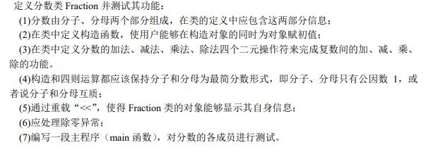
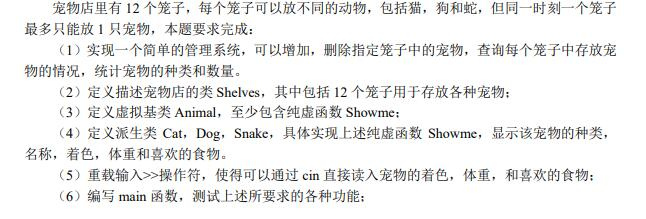

# Cpp Practice

[TOC]

Two programs to practice cpp with modern features and google code style.

## Class Fraction

### Task

### Features

* gcd function with Recursive Lambda

  

## Classes Pet Shelves

### Task

### Features

* template
* pure virtual function and base class
